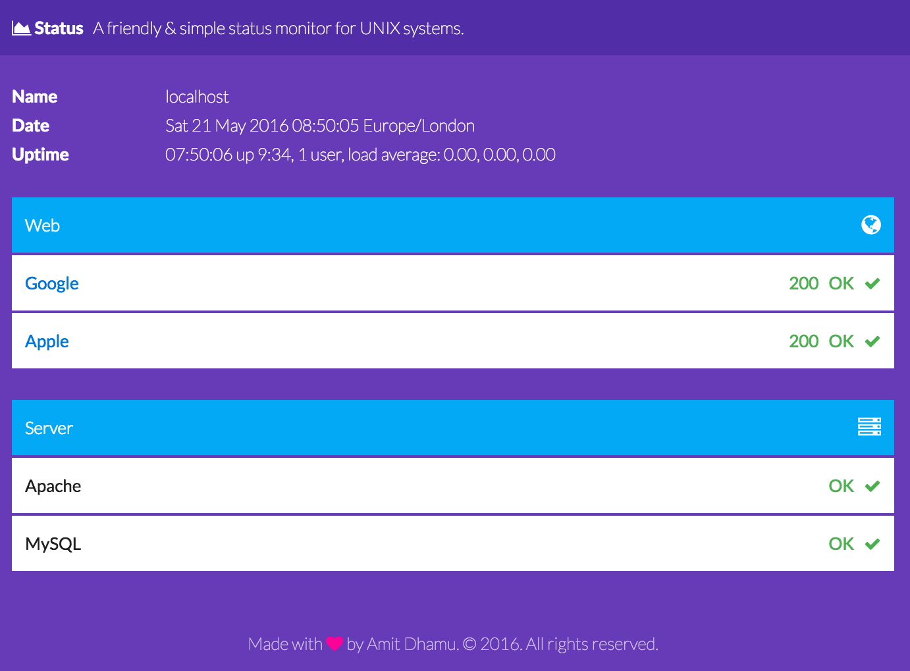

# Status Monitor
A very simple status monitor for UNIX systems.



## Requirements
- Docker
- Composer
- Yarn

## Install
```shell
$ git clone https://github.com/adhamu/status.git
$ cd status
$ mv config.sample.json config.json
$ composer install && yarn && gulp install
$ docker-compose up -d
```

Open up [http://localhost:8888](http://localhost:8888)

## Web services
Pings web endpoints to check HTTP response headers.

## Server services
Check the prescence of a pid file to check if service is running.

## Config
All config for endpoints and services are held in a config.json file. There is a sample file in this repository.

### Sample
```json
{
    "web": [{
        "name": "Google",
        "url": "https://www.google.co.uk"
    }, {
        "name": "Apple",
        "url": "http://www.apple.com/uk"
    }],
    "server": [{
        "name": "Apache",
        "service": "httpd",
        "pid": "/var/run/httpd/httpd.pid"
    }, {
        "name": "MySQL",
        "service": "mysqld",
        "pid": "/var/run/mysqld/mysqld.pid"
    }]
}
```
